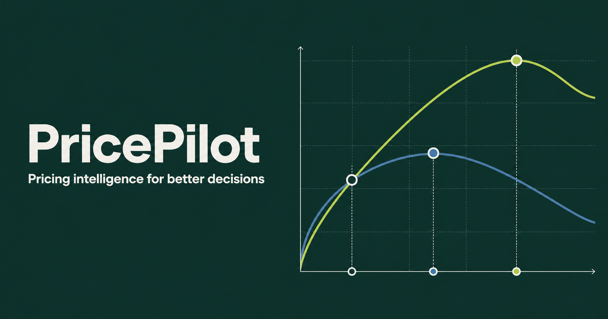
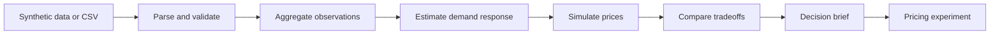
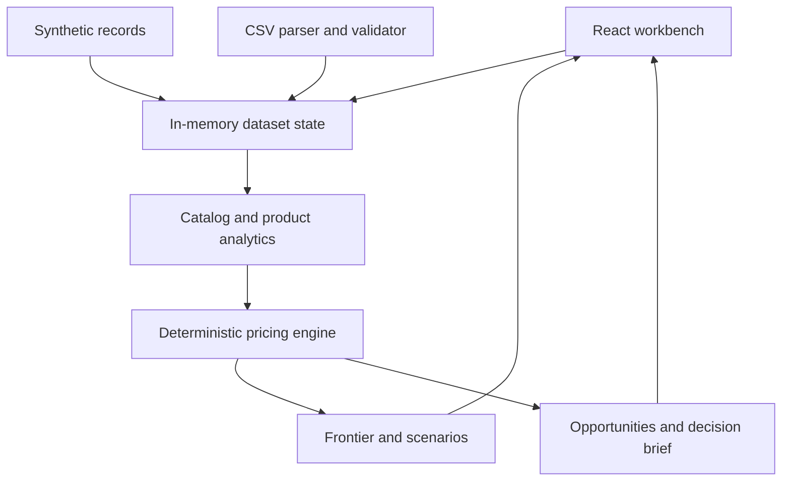

# PricePilot

Deterministic pricing intelligence for exploring how price changes may affect demand, revenue, and contribution profit.

PricePilot turns product sales history into an explainable pricing workbench. It summarizes product-portfolio performance, evaluates individual products, compares candidate prices, tests elasticity assumptions, and produces decision briefs grounded in calculated values. It runs entirely in the browser with synthetic sample data or an imported CSV; no API key, backend, or account is required.



## What PricePilot solves

Pricing creates a coupled decision: a higher price improves contribution per unit but can reduce demand. Revenue, margin, inventory, and profit can therefore move in different directions. Historical data helps, but sparse price variation and unobserved promotions, seasonality, or competitive changes make every estimate uncertain.

PricePilot keeps that tradeoff visible. It separates observed results from modeled outcomes, exposes assumptions, and frames recommendations as testable decisions rather than guarantees.

## Features

- **Product portfolio dashboard** — revenue, contribution profit, units, margin, trends, and derived opportunities, including inventory relative to recent demand.
- **Product analysis** — price, demand, revenue, profit, inventory, estimated elasticity, evidence quality, and relevant history for each product.
- **Price Frontier** — demand, revenue, and profit across candidate prices, with current, revenue-maximizing, and profit-maximizing points marked.
- **Scenario Lab** — editable current, conservative, recommended, and aggressive cases compared side by side.
- **Sensitivity analysis** — shows how alternate elasticity assumptions change projected outcomes and the preferred price.
- **Decision brief** — deterministic recommendation, expected impact, rationale, primary risk, and evidence caveats.
- **Experiment proposal** — control, treatment, hypothesis, primary metric, and guardrails for validating a recommendation.
- **CSV import** — client-side parsing, column mapping, row preview, field-level validation, and partial import of valid rows.
- **Synthetic sample data** — varied product behavior makes the full workflow available immediately.

## Decision workflow



One set of pure TypeScript calculations powers every view. Charts, rankings, recommendations, and experiment proposals therefore reconcile to the same underlying scenario outputs.

## Economics

For price `P`, unit cost `C`, and projected quantity `Q`:

```text
Revenue             = P * Q
Contribution profit = (P - C) * Q
Contribution margin = Contribution profit / Revenue
Price change        = (P_new - P_current) / abs(P_current)
```

Demand uses a constant-elasticity projection:

```text
Q_new = Q_baseline * (P_new / P_baseline) ^ elasticity
```

PricePilot estimates elasticity from valid adjacent historical observations with midpoint, or arc, elasticity. A robust weighted median reduces sensitivity to any one pair. Only sufficiently supported negative estimates drive scenarios; other estimates remain diagnostic while the model uses a disclosed `-1.0` fallback. Candidate prices are evaluated by deterministic grid search. Revenue-maximizing and profit-maximizing prices are selected independently because they often differ.

See [Model documentation](docs/MODEL.md) for methodology, guardrails, and limitations.

## CSV import

Required logical fields:

```text
date, productId, productName, category, price, unitCost, unitsSold, inventory
```

`promotion` is optional. Common headers such as `SKU`, `Cost`, `Quantity`, `Qty`, and `Stock` are mapped automatically; dropdowns support manual mapping. Dates must be real calendar dates in `YYYY-MM-DD` format. Price must be positive, other numeric values must be non-negative, units and inventory must be integers, promotion values must parse cleanly, and duplicate product/date observations are rejected.

Files are parsed locally. PricePilot previews initial rows, reports errors by row and field, and can import valid rows from a mixed file without silently accepting invalid records. Maximum file size is 5 MiB. Imported data remains in memory and is cleared by a page refresh.

## Architecture



Business rules live outside React components. The browser owns temporary data state; there is no persistence layer, server-side calculation path, telemetry, or generative model dependency in the MVP.

See [Architecture](docs/ARCHITECTURE.md) and [engineering decisions](docs/DECISIONS.md).

## Tech stack

- React 19 and TypeScript for typed UI and domain logic
- vinext and Vite for local development and production builds
- Tailwind CSS 4 for the design system
- Recharts for analytical charts
- Lucide for interface icons
- Vitest for model and validation tests

## Getting started

Requirements: Node.js `>=22.13.0` and npm.

```bash
npm install
npm run dev
```

Open the local URL printed by the development server.

## Verification

```bash
npm test
npm run typecheck
npm run lint
npm run build
```

Tests focus on formulas, elasticity estimation, scenario evaluation, optimization, recommendation behavior, CSV parsing, validation, and edge cases.

## Sample data

The bundled dataset is synthetic: five products, 24 monthly observations each, covering July 2024 through June 2026. It exercises different price sensitivity, margin, inventory, trend, promotion, and seasonal patterns; it does not represent any real company or customer. Model estimates are recalculated from those observations rather than copied from generator settings. Use **Import CSV** to replace it for the current browser session.

## Example decision

For **Folio Premium Notebook** in the bundled synthetic data, PricePilot estimates elasticity at `-0.653` with high evidence confidence. The evaluated frontier places the contribution-profit maximum at `$28.48`, versus a current price of `$20.34`. Because that is a large move and the optimum reaches the search boundary, the decision brief stages a first test at `$22.78`:

```text
Projected demand change               -7.13%
Projected revenue change              +4.01%
Projected contribution-profit change  +9.22%
```

These are model outputs from the bundled observations, not measured business results or guaranteed effects.

## Interpretation and limits

- Outputs are estimates, not forecasts with guaranteed accuracy.
- Elasticity describes historical association; it does not prove price caused a demand change.
- Promotions, seasonality, competitors, distribution, product changes, and stockouts can confound demand.
- Sparse observations or limited price variation reduce estimate quality; PricePilot surfaces that limitation.
- Constant elasticity is a local approximation and becomes less credible for large price moves.
- Contribution profit excludes fixed costs, taxes, returns, and other costs absent from the input.
- Grid-search optima are best candidates within the evaluated range, not universal optimal prices.
- Imported data is not persisted or transmitted.

Use recommendations as inputs to a controlled pricing test with commercial, legal, and customer constraints reviewed separately.

## Documentation

- [Product](docs/PRODUCT.md)
- [Economic model](docs/MODEL.md)
- [Architecture](docs/ARCHITECTURE.md)
- [Decisions](docs/DECISIONS.md)
- [Roadmap](docs/ROADMAP.md)
