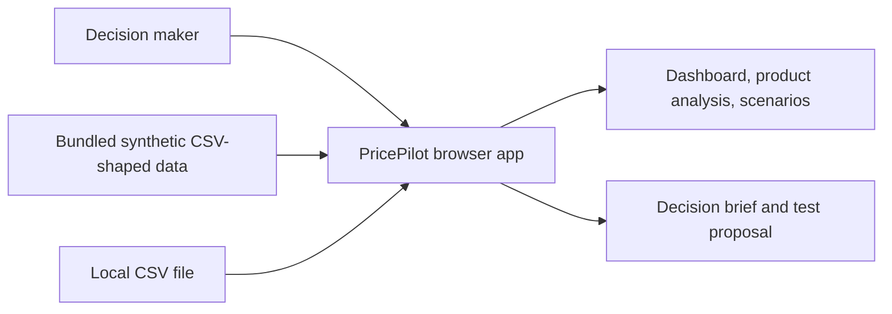
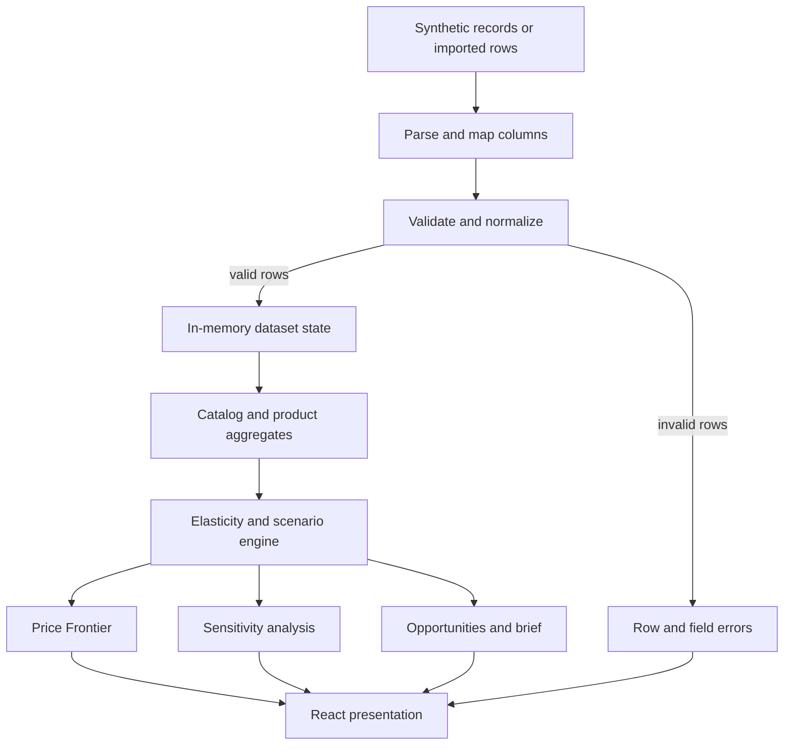
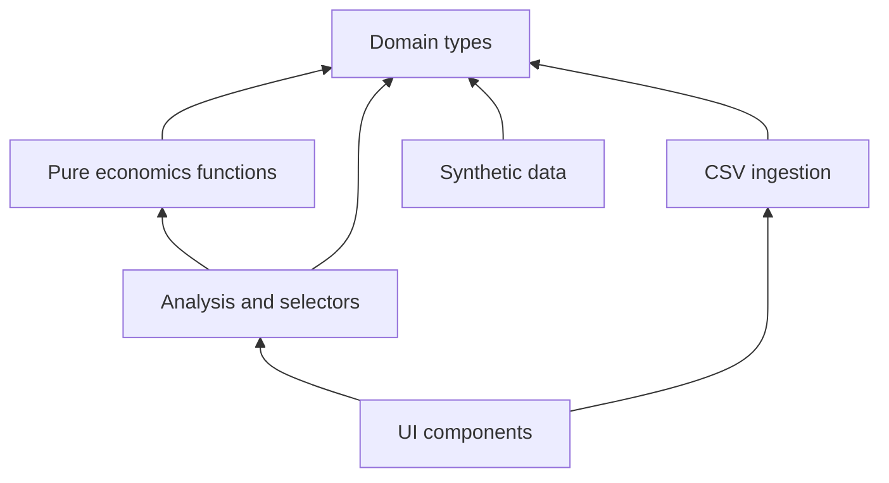

# Architecture

## Overview

PricePilot is a client-side analytical application built with React 19, TypeScript, vinext/Vite, and Tailwind CSS 4. Recharts renders analytical charts, Lucide supplies interface icons, and Vitest verifies deterministic domain behavior.

The MVP has no persistence, server API, authentication requirement, or generative model call. Synthetic and imported records live in browser memory for the current session.

## System context



The local CSV file is read by browser APIs. PricePilot does not upload it to a server.

## Runtime data flow



## Repository map

```text
app/                 Route entry, metadata, and global design system
components/          Workbench shell, views, charts, controls, and CSV UI
data/sample.ts       Deterministic synthetic observation generator
lib/economics.ts     Formulas, projections, elasticity, frontier, validation
lib/analysis.ts      Baselines, summaries, sensitivity, briefs, opportunities
lib/csv.ts           Parsing, header mapping, normalization, row validation
types/pricing.ts     Shared domain contracts
tests/               Model, analysis, and import verification
```

## Boundaries

### Presentation

React components own navigation, controls, tables, cards, charts, empty states, and responsive behavior. They format values but do not reimplement economic formulas.

### Session state

The application owns the active dataset, selected product, active view, import state, and editable scenario assumptions. Switching from sample data to an import recomputes all downstream analysis. Refreshing the page restores the bundled sample.

### Data ingestion

The CSV module handles quoted values, header matching, manual mapping, normalization, preview, and row-level validation. Its output is either a typed record or an explicit error; downstream functions never receive malformed records.

### Domain model

Pure TypeScript functions calculate revenue, contribution profit, margin, changes, elasticity, projected demand, candidate scenarios, frontiers, sensitivity cases, recommendations, opportunities, and experiments. Functions accept data and return values without reading UI state or mutating inputs.

### Sample data

Bundled synthetic observations provide distinct price sensitivity, margin, inventory, and time patterns. Sample records pass through the same analytical path as imported records.

## Dependency direction



Lower layers do not import React. This keeps calculation tests fast and lets multiple views share identical definitions.

## Reliability strategy

- TypeScript types define normalized records and model outputs.
- Runtime validation protects the typed boundary because CSV input is untrusted.
- Pure functions make edge cases reproducible and isolated.
- Vitest covers formula, estimation, optimization, recommendation, parsing, and validation behavior.
- Type checking catches contract drift between model and UI.
- Linting checks common React, accessibility, and TypeScript issues.
- Production builds verify the vinext/Vite integration.

## Privacy and security boundary

Imported data remains in browser memory. No persistence reduces the MVP's data-retention surface, but it also means work cannot be resumed after refresh. PricePilot does not claim that a local browser session alone satisfies an organization's security or compliance requirements.

## Deployment shape

The application builds as a vinext project and requires no application database. Static assets and the application runtime can be deployed together. No environment variables are needed for core behavior.

## Extension points

Future persistence or connectors should enter through explicit repository interfaces rather than changing economics functions. Additional demand models should implement a common scenario contract so Price Frontier, sensitivity, and briefs remain model-agnostic. Those extension points are architectural direction, not current runtime features.
